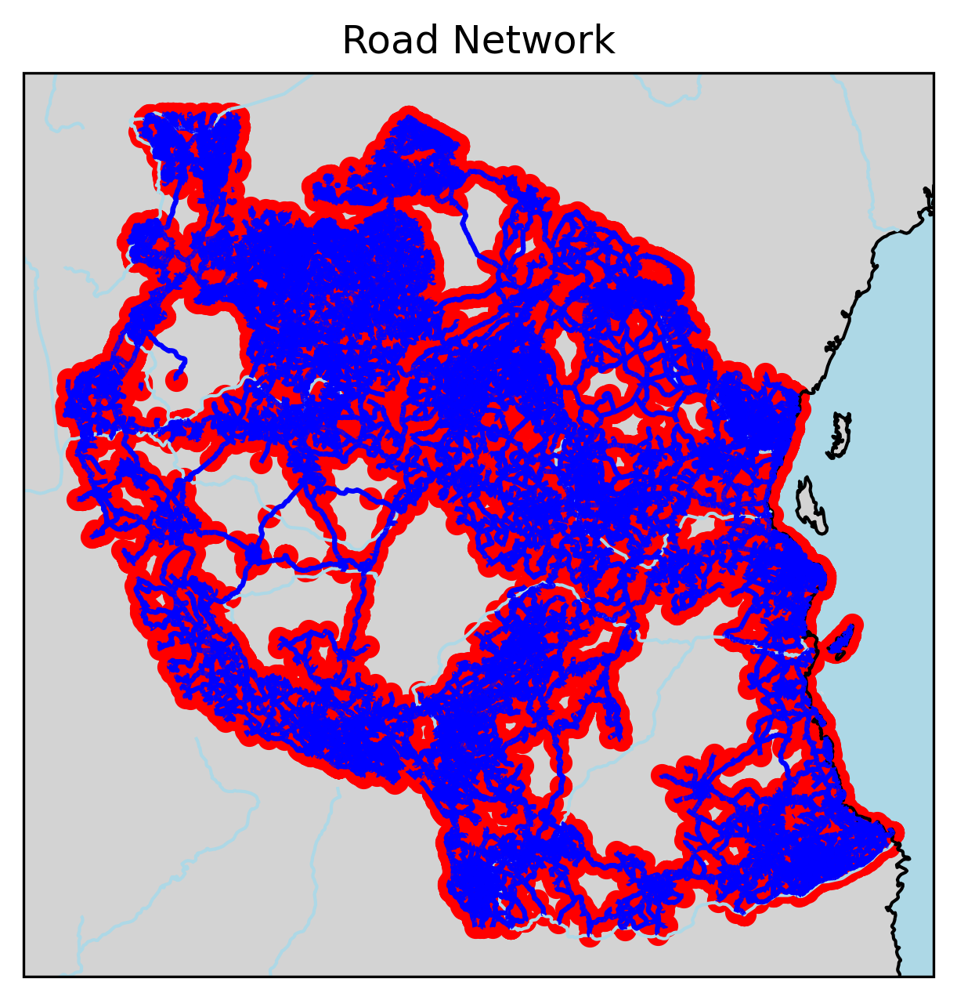
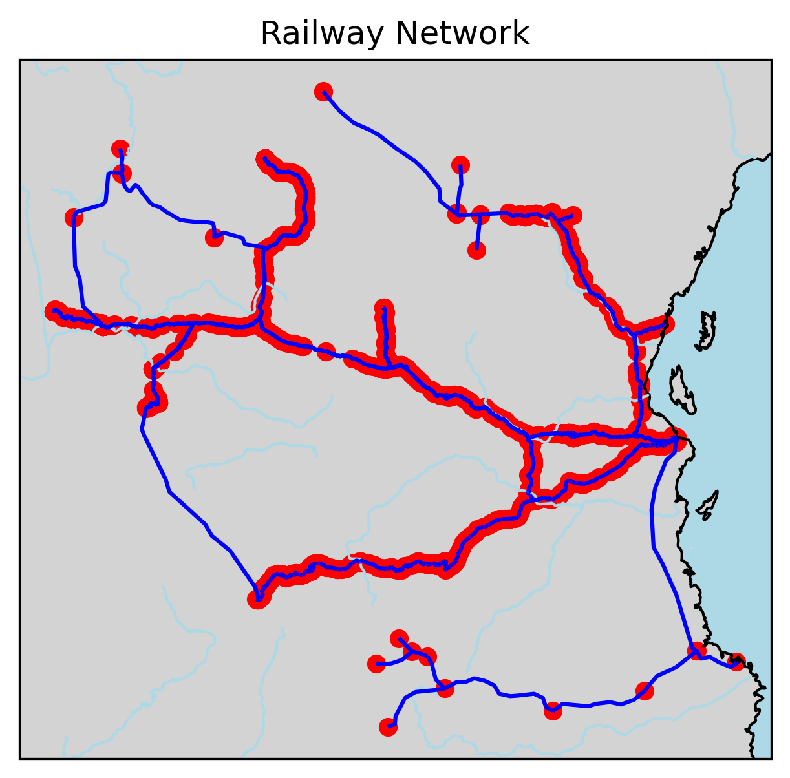
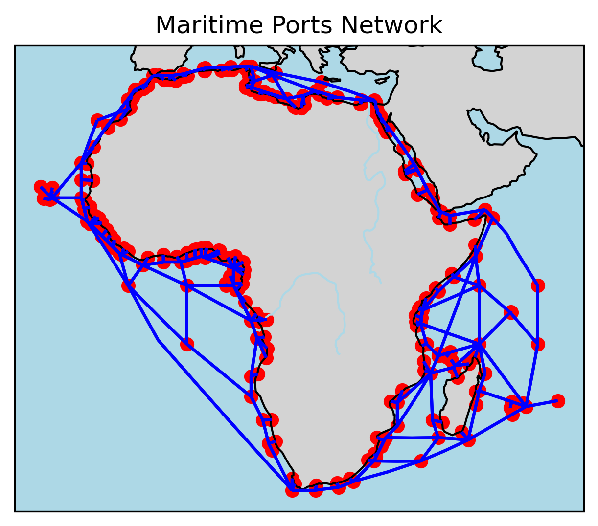

## Quickstart

The following code will intersect an asset (vector in `results/input/assets`) with all hazard scenarios (all rasters in `results/input/hazards/`)
and compute damage and rehabilitation costs.

E.g., for roads in Tanzania, `tza_road`:

```bash
snakemake --cores 4 ../results/damage_costs/tza_road/.all
```

The outputs geoparquet files in `results/damages/final` for each subregion, with the following format:

| id | hazard-{scenarios} | damage-{scenarios} | cost-{scenarios} | unit | unit_type | geometry |
|-----|--------------------|--------------------|------------------|----------|----------|----------|
| ... | float32            | float32            | float32          | float32 | str |  geometry |

## To do

- Add EAD calculation code
- Add point geometry handling
- Test with cyclone and landslide hazard data
- Decide whether to create a separate repo for figures

## Input data

Store all input data somewhere local and set `inputs` in `config.yaml` to point to that location. For each new hazard or asset dataset, create a rule and script to process it into the standardised format in `results/input` and place them in the `hazards` or `assets` folders respectively. It doesn't matter how these are coded as long as their outputs have the correct format and location for the workflow. Processing can also be done externally, and the files simply placed in the correct location in `results/input`.

Data stored in `results/input` should have the following format:

| Data type       | Format       | Location                                      |
|-----------------|--------------|-----------------------------------------------|
| Hazard     | GeoTIFF      | `/results/input/hazards/{hazard}/{subcategory}/{epoch}/{scenario}/rp{rp}.tif` |
| Assets         | GeoParquet   | `/results/input/assets/{asset}/{subregion}.geoparquet` |

The `{hazard}` wildcard must match the hazard names used to classify damage curves and rehabilitation costs. Asset files have the following requirements:
- Have a single geometry type per asset, e.g., LineString, Polygon, Point (no MultiLineStrings)
- Have WGS84 projection
- Have three columns: (unique) `id`, `asset_type` and `geometry`. `asset_type` column that matches naming for damage curves and rehab costs

Hazard rasters must have properly defined NoData values.

To do the damage estimations, the workflow uses damage curves and rehabilitation costs stored in `config/damage_curves` and `config/rehab_costs`. These should be organised as follows:

| Data type       | Format       | Location                                      |
|-----------------|--------------|-----------------------------------------------|
| Damage curves  | CSV          | `config/damage_curves/{hazard}/{asset_type}.csv` |
| Rehabilitation costs | CSV     | `config/damage_curves/{hazard}.csv`|

Rehabilitation costs are indexed by `asset_type`.

For damage curves, have an `intensity` column, then three columns for damage fractions: `damage_fraction_max`, `damage_fraction_min`, `damage_fraction_mean`. Use commenting `#` to note the units of intensity. Costs are specified in `costs_per_unit` with a separate `unit_type` column indicating `m` (LineStrings) or `sqm` (Polygons) or `unit` (Points). Example processing scripts to get input costs and curves into the right format are in `analysis/scripts/`.

Use '#' to mark comment lines in the CSV files.

## Notes on datasets

Available scenarios for all hazard types.

| Hazard | Epochs | Scenarios | Return periods |
|--------|--------|-----------|----------------|
| Fathom | | | |
| Cyclone | | | |
| Landslides | | | |
| Heat | | | |

### Fathom flood data [outdated, need to update]

The Fathom data is provided in 1° rasters, in separate (nested) folders for each flood-driver, time horizon, climate scenario, and return period. Original files are in 1 arc second resolution (~30 m), which is very high and slow, we resample to 3 arc second (~90 m) for processing efficiency.

Input tiles should be organised as follows:

```bash
fathom/{floodtype}/{epoch}/{scenario}/1in{rp}/*.tif
```

with categories

| Variable   | Values (TBC)              |
|------------|---------------------------|
| flood type | pluvial, fluvial, coastal |
| epoch      | 2020, 2050, 2080          |
| scenario   | historical, SSP2-4p5, SSP5-8p5 |
| return period (rp) | 00005, 00010, 00100, 00200, 00500, 01000 |

To process them with open-gira, run:

```bash
snakemake --rerun-incomplete --cores 6 -- fathom_all_historical
snakemake --rerun-incomplete --cores 6 -- fathom_all_scenario
```

### STORM Cyclone data

Currently have historical and 2080 RCP 8.5 data from 2--3 different models. We need to decide how to combine these. Perhaps by min, max, and medians estimats?

### Asset datasets

Stored in geoparquet format. Some projections need to be aligned.

  

#### References

[CCDR-Somalia repository](https://github.com/alisonpeard/oia-somalia-2025)
